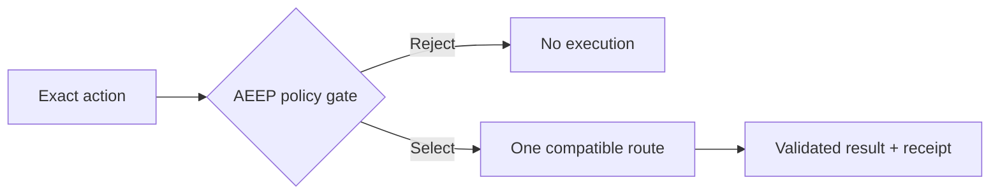

# AEEP Agent Router

AEEP chooses how an AI agent action should run—before the model sees a large
tool catalog.



AEEP can route to local Python, CLI, HTTP, MCP, browser, or subscription-backed
implementations. Unsafe or unaffordable routes are rejected before the
remaining options are scored.

It is an execution control layer—not a planner, marketplace, or model-specific
wrapper.

> **Status:** AEEP 0.6 is alpha software. Review policy, trust, approval, and
> recovery settings before production use.

## What works today

- Host-native routing that keeps hidden tool and router schemas out of model
  context.
- Fail-closed provider packages with signatures, evidence, smoke checks, and
  explicit activation.
- Economic routing with hard limits, approvals, usage receipts, and recovery.

In one bounded GPT-5.6 Terra Medium test, 20 direct Codex turns used 287,104
provider tokens. AEEP selected an exact-compatible local route for the same 20
actions, so no model call was needed. This result applies to that deterministic
action—not every workload. [Read the report](reports/v06/codex/campaign.md).

## Quick start

Python 3.11 or newer is required.

```bash
git clone https://github.com/ptse8204/AEEP-router.git
cd AEEP-router
python3 -m venv .venv
source .venv/bin/activate
pip install -e .

aeep init
aeep doctor
aeep run text.stats --input '{"text":"hello world"}'
```

Preview the decision without executing:

```bash
aeep route text.stats --input '{"text":"hello world"}'
```

## Connect an agent host

Use `aeep host-bridge` for host-native pre-model routing. DeepSeek Harness has a
bundled adapter in [`integrations/dsh-aeep-router`](integrations/dsh-aeep-router/).

A local MCP server is also available when model-facing integration is required.
See [integration guidance](docs/INTEGRATIONS.md).

## Safety defaults

- Hard constraints run before scoring.
- Requests cannot loosen manifest policy.
- Imported routes are inert until qualified and activated.
- Writes and payments require operator approval.
- Inputs and outputs are not persisted by default.
- Commands use argv arrays, never shell interpolation.

## Documentation

- [Specification](SPEC.md)
- [Architecture](ARCHITECTURE.md)
- [Security](SECURITY.md)
- [Provider packages](docs/PROVIDER_PACKAGES.md)
- [Evidence reuse](docs/EVIDENCE_REUSE.md)
- [Economic accounting](docs/ACCOUNTING.md)
- [Migration to 0.6](docs/MIGRATION_0.6.md)
- [Examples](examples/quickstart/README.md)
- [Changelog](CHANGELOG.md)

## Development

```bash
pip install -e '.[dev,http-server]'
ruff check .
mypy src
pytest
```

Licensed under [Apache-2.0](LICENSE).
