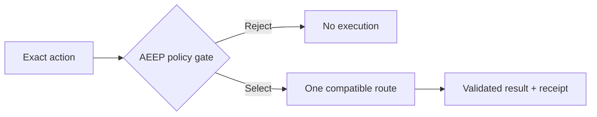

# AEEP Agent Router

AEEP helps an agent choose an approved tool for a specific task. It checks
permissions and applicable evidence before execution, then records the result,
verification and resource use. It also tests whether an added skill or plugin
helps compared with the tools the agent already has.


```mermaid
flowchart LR
    A[Exact action] --> B{AEEP policy gate}
    B -->|Reject| C[No execution]
    B -->|Select| D[One compatible route]
    D --> E[Validated result + receipt]
```

The host agent plans the work. AEEP handles the choice of implementation for each
bounded action, using local policy and evidence without another routing-model
call. Routes can use Python, CLI, HTTP, MCP, browser or subscription-backed
execution. Hard constraints exclude unsafe or unaffordable routes before scoring.
The host keeps its normal discovery and progressive disclosure behavior.

## Current status

**Status:** AEEP 0.8 is in development. The tested native workflow runs on macOS in a Codex
session without a container stack. A reviewed project scope limits which
capabilities it can use, their permissions, attempt count, expiry and execution
time. Users can inspect, pause, stop or undo AEEP-owned configuration changes.

The native path has completed small and larger workbook tasks with independent
checks of the requested changes and declared preservation requirements. It
returns concise explanations from recorded receipts. Workbook support covers the
reviewed operations; it does not establish preservation of arbitrary workbooks,
macros or external links.

The latest recorded software run passed 1,160 tests, with 15 skipped, and all
21 native/software checks. Combined statement and branch coverage was 82.33%.
The 12 container checks failed while Docker was unresponsive. Full live
qualification and human usability remain incomplete, so this is not a completed
0.8 product release. The [plan coverage record](reports/v08/plan-coverage.md)
tracks results and remaining work separately.

## What the live workbook test found

Both native Codex and Codex with AEEP completed the same two workbook tasks and
passed independent grading:

| Measurement | Native Codex | Codex with AEEP |
|---|---:|---:|
| Correct workbooks | 2/2 | 2/2 |
| Production host lifespan | 79.355 s | 17.717 s |
| Peak sampled process-tree memory | 404.59 MiB | 592.93 MiB |
| Observed CPU time | 2.148 s | 3.550 s |
| Provider-reported total tokens | 123,203 | 60,201 |

AEEP was faster and used fewer reported tokens in this pair, but used more peak
memory and CPU. The pair ran in a fixed order with AEEP invocation required. It
passed the resource budgets set for this workload; it does not establish general
savings or the benefit of optional capability selection. Provider cash and
subscription consumption were unavailable. See the
[comparison](reports/v08/native-model-resource-evaluation-5fff-comparison.json)
and [resource acceptance record](reports/v08/native-model-resource-evaluation-5fff-acceptance-interpretation.json).

Four separate autonomy scenarios produced one verified task completion and three
safe stops. Ordinary work and the paused case passed their fixed conditions.
Permission-expansion and recovery cases stopped safely but failed two strict
response or behavior conditions. Those failures remain recorded in the
[scenario audit](reports/v08/native-sol61-autonomy-four-scenarios-5fff-canonical-audit.json).

## Project operation and plugin assessment

For the native workflow, follow
[project-local operation](docs/ASSESSMENT.md#project-local-task-operation).
Activation, pause/stop, rollback and task responses share the existing router,
approvals, durable attempts and receipts.

Assessment runs separately from ordinary tasks. Select a local subject, review
its recipe and implementation mapping, authorize finite resources, then run the
comparison. A candidate can lose without making the campaign incomplete. Scoped
automatic use remains reversible.

The [assessment guide](docs/ASSESSMENT.md) covers commands, supported recipes,
SQLite migration and unfinished integration and accounting work. Run
`aeep verify assessment-product` to inspect offline checks separately from live
Codex evidence. Controlled agent comparisons require the reviewed assessment
workers; ordinary routing continues without them.

## Other supported paths

- Host-native routing keeps implementation and router schemas out of model
  context when the host supplies the exact action.
- The managed OpenAI/ChatGPT subscription adapter uses the official local Codex
  App Server. Codex owns authentication and model discovery.
- Capacity reservations and execution attempts support durable recovery across
  providers.
- Provider packages require signatures, evidence, smoke checks and explicit
  activation; failed checks leave them inactive.
- Economic routing records hard limits, approvals and usage receipts, with
  recovery for interrupted work.
- The x402 capacity contract is offline. Live marketplace networking is disabled
  by default.

## Earlier deterministic-tool result

An earlier test compared model-driven tool selection with direct routing when the
exact deterministic tool and structured action were already known.

| 20 matched actions | Codex + exact tool | AEEP + same tool |
|---|---:|---:|
| Exact results | 20/20 | 20/20 |
| Verified local-tool executions | 20/20 | 20/20 |
| Provider input + output tokens | 584,449 | 0 |
| Median tokens per action | 28,888 | 0 |
| Median latency | 8,324.9 ms | 5.47 ms |

Both sides were installed before measurement. Codex received the exact command
and could not discover or install anything. It still used a model/tool/model
loop. AEEP received the structured `text.stats@1` action and invoked the same
Python function without a provider call.

This result applies to the measured `text.stats@1` action class. It does not
measure installation, natural-language intent recognition or work requiring
model judgment. Codex totals include its full host context; the meter cannot
attribute every token to an individual schema. Unknown usage stays unknown, and
local conformance does not establish live-market readiness. See the
[method, exclusions, and raw accounting](reports/v06/codex/tool-ready-campaign.md).

## Quick start

Python 3.11 or newer is required.

```bash
git clone https://github.com/ptse8204/AEEP-router.git
cd AEEP-router
python3 -m venv .venv
source .venv/bin/activate
pip install -e .

aeep init
aeep doctor
aeep run text.stats --input '{"text":"hello world"}'
```

Preview the decision without executing:

```bash
aeep route text.stats --input '{"text":"hello world"}'
```

## Connect an agent host

Use `aeep host-bridge` for host-native pre-model routing. DeepSeek Harness has a
bundled adapter in [`integrations/dsh-aeep-router`](integrations/dsh-aeep-router/).

A local MCP server is also available when model-facing integration is required.
See [integration guidance](docs/INTEGRATIONS.md).

## Permissions and data

- Hard constraints run before scoring.
- Requests cannot loosen manifest policy.
- Imported routes are inert until qualified and activated.
- Writes and payments require operator approval.
- Inputs and outputs are not persisted by default.
- Commands use argv arrays, never shell interpolation.
- Personal subscription capacity is `SELF_ONLY` and cannot be resold or used to
  issue an external entitlement.
- Marketplace/x402 networking and value movement are absent and disabled by
  default.

## Documentation

- [Specification](SPEC.md)
- [Architecture](ARCHITECTURE.md)
- [Security](SECURITY.md)
- [Provider packages](docs/PROVIDER_PACKAGES.md)
- [Evidence reuse](docs/EVIDENCE_REUSE.md)
- [Economic accounting](docs/ACCOUNTING.md)
- [Migration to 0.7](docs/MIGRATION_0.7.md)
- [Examples](examples/quickstart/README.md)
- [Changelog](CHANGELOG.md)

## Development

```bash
pip install -e '.[dev,http-server]'
ruff check .
mypy src
coverage run --branch -m pytest
coverage json -o reports/v07/coverage.json
python3 scripts/check_critical_coverage.py reports/v07/coverage.json
aeep verify router-complete --profile all --strict --json
```

Licensed under [Apache-2.0](LICENSE).

Read the [assessment testing policy](docs/ASSESSMENT_TESTING.md) before changing or running
assessment, execution-adapter or release-verification work in this repository.
