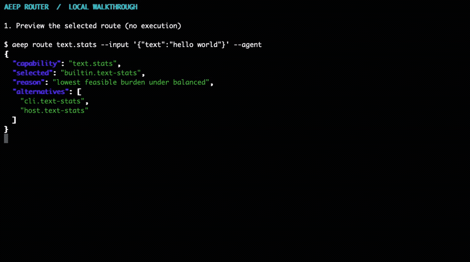

# AEEP Agent Router

> **Active development — use at your own risk.** AEEP is experimental and may
> break, including workflows that currently work. Updates may introduce breaking
> changes to APIs, configuration and stored data. Backward compatibility is not
> guaranteed.

AEEP lets an AI agent use approved tools for specific tasks. It checks permissions,
selects a compatible implementation, runs the action and records what happened.
It can also test whether a skill or plugin improves results compared with the
tools the agent already has.

The agent still plans the work. AEEP handles individual actions, such as running
a text calculation or a reviewed workbook operation. A **route** connects an action
to an **executor**, the implementation that performs it. Executors can use Python,
CLI commands, HTTP, MCP, a browser or a subscription-backed agent. AEEP excludes
routes that violate permissions or resource limits before ranking the remaining
choices. Selection uses local rules and evidence, without another model call.

## Watch it run

[](https://github.com/ptse8204/AEEP-router/raw/refs/heads/main/docs/media/aeep-demo.mp4)

[Watch the MP4](https://github.com/ptse8204/AEEP-router/raw/refs/heads/main/docs/media/aeep-demo.mp4)
· [Commands and transcript](docs/media/README.md)
· [Install in Codex](#install-in-codex)

This records actual local commands. The stack examples use synthetic media, data
and research fixtures; the media result is an edit timeline, not a generated video.
The recording omits private desktop content and uses no paid provider calls.

## Install in Codex

On macOS or Linux, install Python 3.11+ and the Codex CLI, then run:

```bash
git clone https://github.com/ptse8204/AEEP-router.git
cd AEEP-router
python3 -m venv "$HOME/.local/share/aeep/venv"
"$HOME/.local/share/aeep/venv/bin/python" -m pip install .
"$HOME/.local/share/aeep/venv/bin/aeep" init "$HOME/.config/aeep/config.yaml"
codex plugin marketplace add ptse8204/AEEP-router --ref main
codex plugin add aeep@aeep-router
```

This adds the repository's **AEEP Router** marketplace and installs its plugin.
It uses a dedicated Python environment and a local manifest with a working
`text.stats` example. Keep an existing manifest if `init` reports that it already
exists. Installation does not approve new capabilities, assessments or payments.
The core launcher uses the standard router profile; assessment and scoped task
profiles still require their own setup.

Restart Codex after installation, then open a new chat. In the CLI, `/mcp` shows
active servers. In the desktop app, find AEEP in the Plugins directory. The plugin
uses the dedicated environment directly, so the app needs no virtualenv activation.
[Codex marketplace documentation](https://developers.openai.com/plugins/build/plugins)
explains the Git-backed installation and refresh commands. This repository
marketplace is separate from OpenAI's public plugin directory.

### Try it in conversation

Ask Codex:

> Use AEEP to list the available capabilities. Preview a route for counting the
> characters, words and lines in "hello world". Explain the selection before
> running anything.

Then:

> Execute that text.stats action through AEEP. Show the result, selected executor,
> verification status and receipt ID.

The bundled example returns **11 characters, 2 words and 1 line**. To explore the
stack planner, ask:

> Help me describe my task as a GoalSpec and propose an AEEP stack using only
> configured capabilities. Keep cash at zero, report missing providers and
> compatibility blockers, and stop after the proposal.

An installation starts with the text example, not an unrestricted tool catalog.
Use the [stack guide](docs/STACK_PLANNING.md) to add reviewed capabilities and run
the media, data and research demonstrations.

### Keep it updated

There are two parts to update: the Python runtime and the marketplace plugin.
From a clean `main` checkout, run:

```bash
git pull --ff-only origin main
"$HOME/.local/share/aeep/venv/bin/python" -m pip install .
"$HOME/.local/share/aeep/venv/bin/aeep" doctor
codex plugin marketplace upgrade aeep-router
codex plugin add aeep@aeep-router
```

Restart Codex to load the updated server. Keep your manifest and receipt database;
do not rerun `init` or overwrite them. Stop on a failed command, local edits or a
diverged branch. Review the changelog before updating: AEEP is experimental.

For automatic updates, ask Codex to create a daily automation:

> Every day, check origin/main for this AEEP checkout. If there is an update,
> preserve at least 50 GiB free, require a clean main branch and fast-forward only.
> Validate the update, install it into ~/.local/share/aeep/venv, run aeep doctor,
> refresh only the aeep-router marketplace and reinstall aeep@aeep-router.
> Preserve my manifest, receipts, grants and credentials. Stop on failures or
> migration requirements. Notify me when an update is installed or needs attention;
> stay quiet when nothing changed. Remind me to restart Codex after an update.

This schedules updates through Codex while its scheduler is available; plugin
startup itself does not download or install code. To disconnect the plugin, run
`codex plugin remove aeep@aeep-router`; disable any update automation separately.

## When to use it

| Use case | Why AEEP is useful | Evidence and limits |
|---|---|---|
| Run a known, repeatable operation | Once the action is known, call its tool directly without asking a model to select it again. | Both approaches returned correct results for 20 matched `text.stats@1` actions. This does not measure natural-language planning. |
| Give an agent limited access to a project tool | Restrict the tool, permissions, attempt count, runtime and expiry; inspect or withdraw access later. | Two native workbook tasks passed independent checks. Support is limited to the reviewed workbook operations. |
| Evaluate a skill before enabling automatic use | Test correctness and compare optional access with the agent's existing tools. Keep failed results available for review. | The DOCX and composed workbook studies completed and did not qualify. General benefit remains unproven. |
| Explain and recover from execution | Record the selected tool, outcome, verification and measured resource use in a **receipt**. Track interrupted attempts before allowing more work. | Software and controlled workflow tests cover accounting, revocation and recovery; live failures and missing measurements remain visible. |

## How it works

1. Find a candidate tool, skill or plugin through configured discovery. Registry
   results are suggestions; finding one does not install or enable it.
2. Record the exact local files and the executor that will run them. Review these
   definitions before execution. This preparation step is called **intake**.
3. Test the candidate. **Qualification** checks whether it meets the task's
   correctness requirements. A separate comparison checks whether optional access
   improves an already capable agent's results or resource use.
4. Approve automatic use only for the tested conditions. This approval is an
   **admission**. A **task scope** separately limits the permitted executor,
   permissions, attempts, runtime and expiry. Activate the reviewed project profile
   to make those scoped tools available to the host agent.
5. Run ordinary tasks. The agent requests an action; AEEP checks current permission
   and evidence, selects an eligible route, and records its result and receipt.
   Ordinary routing does not need assessment workers.
6. Inspect the receipts or withdraw access. Pause or uninstall the project profile,
   or revoke an admission to prevent further use through that approval.

A controlled test exercised this sequence through revocation and cleanup. A live
registry search returned four candidates, but none matched the selected
SkillsBench skill. A failed qualification prevents that candidate from advancing
to automatic use; it does not erase the test results.

See the [discovery and intake commands](docs/INTEGRATIONS.md#discovery-intake-and-local-evidence-lookup)
and [project setup and controls](docs/ASSESSMENT.md#project-local-task-operation).
The [assessment guide](docs/ASSESSMENT.md) covers recipes, finite resource
approvals, comparisons, SQLite migration and remaining accounting work.
`aeep verify assessment-product` reports offline checks separately from live
Codex evidence. Controlled agent comparisons require separate reviewed workers.

## Test results and current limits

**Status:** AEEP 0.8 is in development. Its tested native workflow runs in a Codex session on
macOS without a container stack. Users can inspect, pause, stop or undo AEEP-owned
project configuration changes. A completed 0.8 product release still requires the
remaining live comparison and adoption checks.

| Test | Recorded result | What it establishes |
|---|---|---|
| [Software suite, October 5](reports/v08/codex-install-20261005/summary.md) | 1,267 passed under coverage, 21 skipped; 82.08% combined statement and branch coverage | The tested software behavior passed. Skipped checks remain unverified by this run. |
| Native workbook tasks | Both native Codex and Codex with AEEP passed 2/2 tasks | The requested changes and declared preservation requirements were checked independently. |
| Known deterministic tool | Both approaches passed 20/20 matched actions, with 20/20 verified executions | Direct routing worked for the measured `text.stats@1` action class. |
| SkillsBench DOCX qualification, Luna/xhigh | 137/141 passed; two text-preservation failures and two timeouts | The candidate did not qualify. A separate pinned public-fixture verifier passed 18/18 assertions. |
| Composed workbook qualification, Luna/xhigh | 136/141 passed; five timeouts, including four holdouts | The report records `insufficient_evidence`; the workflow did not qualify. |

In all five composed workbook timeouts, the native workbook operation completed
successfully and produced a valid child receipt. The surrounding agent workflow
failed to finish before its deadline. The cause of that delay is under
investigation; successful child execution does not make the full trial a pass.

The real three-way comparison of normal agent use, discovery alone, and discovery
plus AEEP remains unrun. Missing resource measurements prevent a savings claim
for these qualification studies. General workbook preservation, macros, external
links and population-wide usability are outside the demonstrated results.

The [evidence guide](docs/EVIDENCE.md) describes the tests, useful cases and limits.
The [plan coverage record](reports/v08/plan-coverage.md) contains exact run
references, historical environment failures and remaining work.

## Measured examples

### Native workbook comparison

Both approaches completed the same two workbook tasks and passed independent grading.

| Measurement | Native Codex | Codex with AEEP |
|---|---:|---:|
| Correct workbooks | 2/2 | 2/2 |
| Production host lifespan | 79.355 s | 17.717 s |
| Peak sampled process-tree memory | 404.59 MiB | 592.93 MiB |
| Observed CPU time | 2.148 s | 3.550 s |
| Provider-reported total tokens | 123,203 | 60,201 |

AEEP finished faster and used fewer reported tokens in this pair, with higher
peak memory and CPU use. The runs used a fixed order and required AEEP invocation.
They passed the resource budgets set for this workload; they do not establish
general savings or the benefit of optional tool selection. Provider cash and
subscription consumption were unavailable. See the
[comparison](reports/v08/native-model-resource-evaluation-5fff-comparison.json)
and [resource acceptance record](reports/v08/native-model-resource-evaluation-5fff-acceptance-interpretation.json).

Four separate autonomy scenarios produced one verified task completion and three
safe stops. Ordinary work and the paused case met their fixed conditions.
Permission-expansion and recovery cases stopped safely but failed two strict
response or behavior conditions. See the
[scenario audit](reports/v08/native-sol61-autonomy-four-scenarios-5fff-canonical-audit.json).

### Direct execution of a known tool

An earlier test compared model-driven tool selection with direct routing when the
exact deterministic tool and structured action were already known.

| 20 matched actions | Codex + exact tool | AEEP + same tool |
|---|---:|---:|
| Exact results | 20/20 | 20/20 |
| Verified local-tool executions | 20/20 | 20/20 |
| Provider input + output tokens | 584,449 | 0 |
| Median tokens per action | 28,888 | 0 |
| Median latency | 8,324.9 ms | 5.47 ms |

Both sides were installed before measurement. Codex received the exact command
and could not discover or install anything. It used a model/tool/model loop.
AEEP received the structured `text.stats@1` action and invoked the same Python
function without a provider call.

This measures the execution of that action class, excluding installation,
natural-language intent recognition and work requiring model judgment. Codex
totals include its full host context; the meter cannot attribute every token to
an individual schema. Unknown usage remains unknown. See the
[method, exclusions, and raw accounting](reports/v06/codex/tool-ready-campaign.md).

## Quick start

Python 3.11 or newer is required.

```bash
git clone https://github.com/ptse8204/AEEP-router.git
cd AEEP-router
python3 -m venv .venv
source .venv/bin/activate
pip install -e .

aeep init
aeep doctor
aeep run text.stats --input '{"text":"hello world"}'
```

Preview the decision without executing:

```bash
aeep route text.stats --input '{"text":"hello world"}'
```

## Connect an agent

Use `aeep host-bridge` when the host supplies an exact action before a model call.
This keeps implementation and router schemas out of model context. DeepSeek
Harness has a bundled adapter in
[`integrations/dsh-aeep-router`](integrations/dsh-aeep-router/).
A local MCP server is available for model-facing integration. See
[integration guidance](docs/INTEGRATIONS.md).

The managed OpenAI/ChatGPT subscription adapter uses the official local Codex
App Server. Codex owns authentication and model discovery. Capacity reservations
and durable execution attempts support recovery across providers. Provider
packages require signatures, evidence, smoke checks and explicit activation;
failed checks leave them inactive. See [provider packages](docs/PROVIDER_PACKAGES.md).

## Permissions and data

- Hard constraints run before scoring; requests cannot loosen manifest policy.
- Imported routes remain inactive until qualified and activated.
- Writes and payments require operator approval.
- Inputs and outputs are not persisted by default.
- Commands use argv arrays, never shell interpolation.
- Personal subscription capacity is `SELF_ONLY` and cannot be resold or used to
  issue an external entitlement.
- Economic routing records limits, approvals and usage receipts, including
  interrupted work. The x402 capacity contract is offline; marketplace networking
  and value movement are absent and disabled by default. Local conformance does
  not establish live-market readiness.

## Documentation

- [Evidence guide](docs/EVIDENCE.md) and [implementation status](reports/v08/plan-coverage.md)
- [Specification](SPEC.md), [architecture](ARCHITECTURE.md) and [security](SECURITY.md)
- [Evidence reuse](docs/EVIDENCE_REUSE.md) and [economic accounting](docs/ACCOUNTING.md)
- [Migration to 0.7](docs/MIGRATION_0.7.md)
- [Examples](examples/quickstart/README.md) and [changelog](CHANGELOG.md)

## Development

Read the [assessment testing policy](docs/ASSESSMENT_TESTING.md) before changing or
running assessment, execution-adapter or release-verification work.

```bash
pip install -e '.[dev,http-server]'
ruff check .
mypy src
coverage run --branch -m pytest
coverage json -o reports/v07/coverage.json
python3 scripts/check_critical_coverage.py reports/v07/coverage.json
aeep verify router-complete --profile all --strict --json
```

Licensed under [Apache-2.0](LICENSE).

## Stack proposals

AEEP can select implementations for a host-supplied semantic task graph. The
planner checks typed edges, configured converters, policy and aggregate estimates;
the runtime executes reviewed free local configurations and records progress.
`aeep stack` exposes proposal, preflight, assembly and recovery controls.

The [stack guide](docs/STACK_PLANNING.md) includes runnable media, data and
research fixtures. They validate offline composition and recovery. Actual provider
onboarding is still an open release gate: existing authenticated connection checks
do not establish a new sign-in journey or credential-bound billing readiness.
